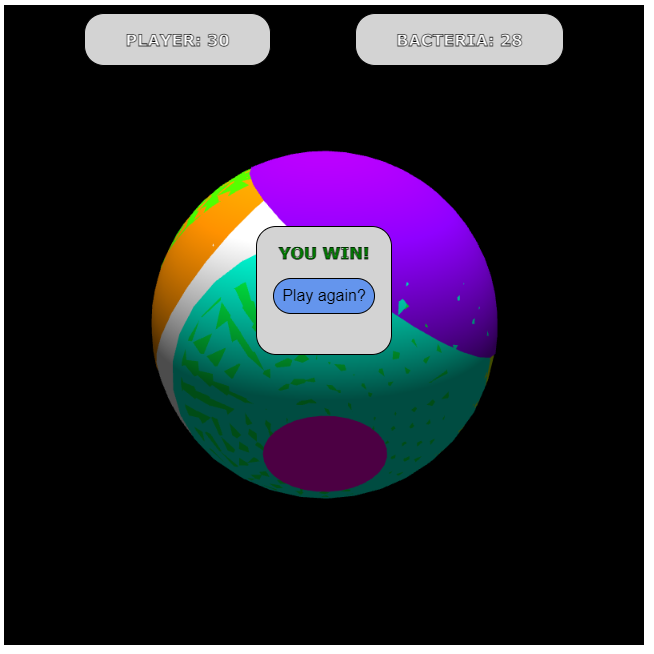

# Assignment 4
Bridgette Hunt 
COSC 414 001 2023W2 

>
> NOTE: Because I am using JavaScript modules for this assignment, the plain HTML file cannot be
> used on its own. Please test the assignment content at the following link:
> 
> https://bhunt02.github.io/cosc-414-a4/
> 

I elected to utilize a different matrix mathematics library for JavaScript (NOT three.js) that
offered the same functionality that the textbook's libraries contained, but in a way that was easier
and more consistent to utilize.

Most of the files I used to write this assignment (and those I wrote for it) are contained
in the `./app` module directory. Inside is the glMatrix source files (I only took the modules) for 
the vectors and matrices) and my project source files (in `./app/src/`) which I've used.

I took some functionality from `webgl-utils.js` and `cuon-utils.js` and created my own utility for
creating the WebGL context in `./app/src/util.mjs`.

At the end of this document I've left citations for any algorithms/sources that were not derived from
the provided libraries for the course.

## Gallery

<table>
<tr>
<td>

</td>
</tr>
<tr>
<td>

* Implemented the functionality of the 2D version while turning into 3D
* Bacteria are dynamic ellipsoids that grow on the surface of the sphere
* Instead of creating static color difference, implemented lighting
</td>
</tr>
<tr>
<td>

</td>
</tr>
<tr>
<td>

* Kept win conditions consistent with prior assignments
* Used 'picking' technique (cited below) to register clicks on bacteria
* Can refresh via the interface to replay rather than the browser refresh button
</td>
</tr>
<tr>
<td>

</td>
</tr>
</table>

## Citations
* Align object to vector:
  * https://stackoverflow.com/a/10923592
  * `Used in: ./app/src/Classes/Objects/Bacterium.mjs`
* OpenGL Sphere
  * https://www.songho.ca/opengl/gl_sphere.html#webgl_sphere 
  * `Used in: ./app/src/Classes/Objects/Ellipsoid.mjs (altered)`
* glMatrix Module Source
  * https://glmatrix.net/
  * `Used in: ./app/src/Projection, ./app/src/Classes/App, ./app/src/Classes/Objects/{BaseObject, Bacterium}`
* HSV to RGB Color Conversion 
  * https://stackoverflow.com/questions/17242144/javascript-convert-hsb-hsv-color-to-rgb-accurately
  * `Used in: ./app/src/util.mjs`
* webgl-utils.js
  * Course library
  * `Used in ./app/src/util.mjs (altered)`
* cuon-utils.js
  * Course library
  * `Used in ./app/src/util.mjs (altered)`
* WebGL Object Picking
  * https://webglfundamentals.org/webgl/lessons/webgl-picking.html
  * `Used in: ./app/src/util.mjs (altered)`